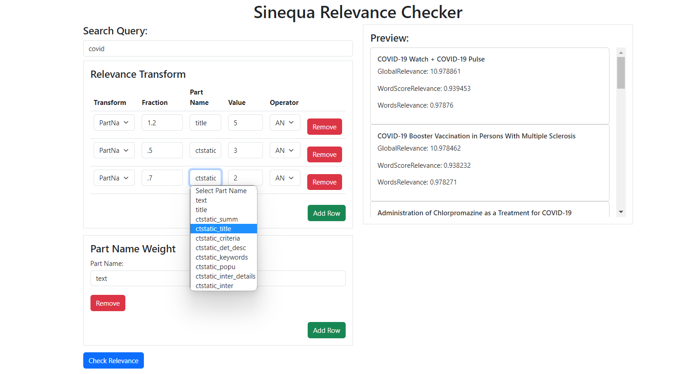
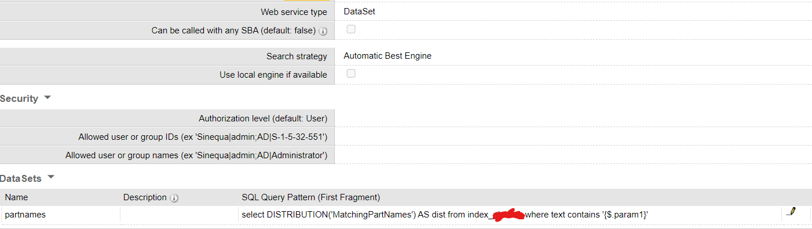

# Relevance Checker App

This is a web application built with Angular that allows you to perform relevance checks in sinequa by specifying search query parameters and applying relevance transforms.

### NOTE: These are very basic relevancy checks and it is advisable to go through sinequa's relevancy documentation before using the app. A lot of relevance parameters have not been configured and I hope I will be enhancing and adding new features to the app in the future. The purpose of the app is not to mimic or replace Sinequa's relevancy configs but it provides a more intuitive interface for a user to quickly tweak some parameters and see results instantly. But your contributions and suggestions are always welcome!

## Prerequisites

To run this application, you need to have the following software installed on your machine:

- Node.js (version 12 or above)
- Angular CLI (version 12 or above)

## Installation

1. Clone the repository to your local machine:

- git clone https://github.com/shravanv90/relevance-checker-app.git

2. Navigate to the project's directory:

- cd relevance-checker-app

2. Modify the config.ts as per your app

3. Add a dataset query to fetch partnames:

3. Install the dependencies using npm:

- npm install

## Usage

1. Start the development server:

- ng serve

2. Open your web browser and go to http://localhost:4200 to access the application.

3. Use the application to enter your search query parameters, configure relevance transforms, and specify part name weights.

4. Click the "Send Request" button to perform a relevance check.

## Deployment

To deploy the application to a production environment, follow these steps:

1. Build the application:

- ng build --prod

2. The build artifacts will be stored in the `dist/` directory.

3. Deploy the contents of the `dist/` directory to your web server or hosting provider.

4. Configure your web server to serve the application.

## Contributing

Contributions are welcome! If you have any ideas, improvements, or bug fixes, please open an issue or submit a pull request.
